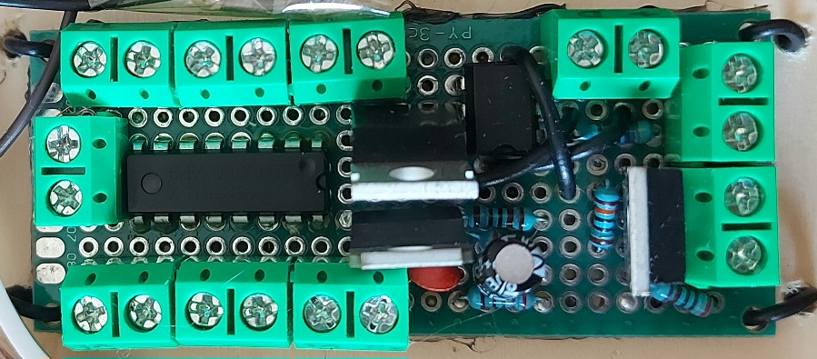
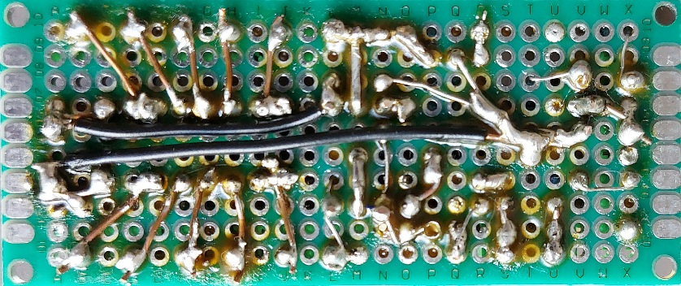
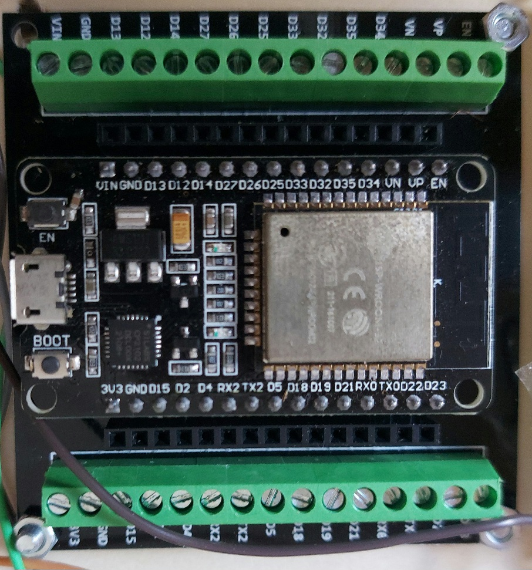
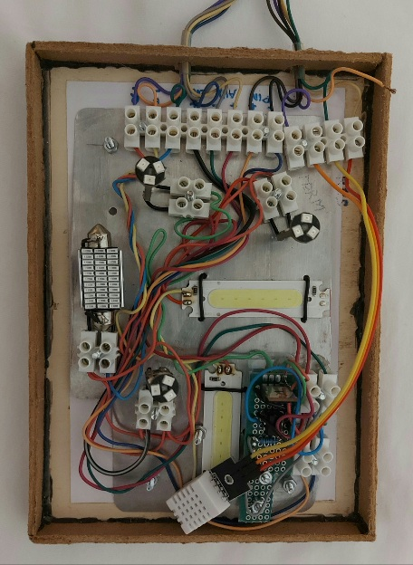
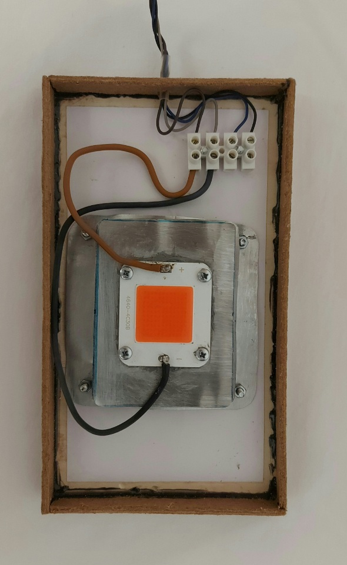
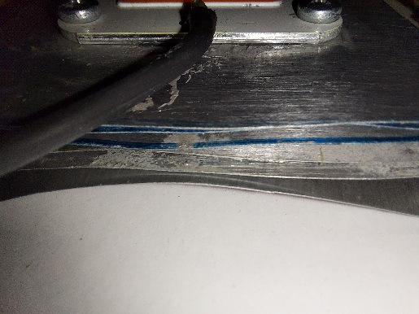

## Descripción 

<!--
**microindoor/microindoor** is a ✨ _special_ ✨ repository because its `README.md` (this file) appears on your GitHub profile.

Here are some ideas to get you started:

- 🔭 I’m currently working on ...
- 🌱 I’m currently learning ...
- 👯 I’m looking to collaborate on ...
- 🤔 I’m looking for help with ...
- 💬 Ask me about ...
- 📫 How to reach me: ...
- 😄 Pronouns: ...
- ⚡ Fun fact: ...
-->
Microindoor permite crear un cultivo indoor a medida según los recursos de los que uno disponga, puedes utilizar relés para luz, resistencias eléctricas, o ventiladores de CA, o PWM y mosfets si esos aparatos funcionan con CC, termistores y no ventiladores si sólo vas a medir temperatura y no puedes regularla porque no tienes ventiladores, o termistores y si ventiladores si los tienes, o si consigues un dht22 puedes medir además humedad, y si tienes ventiladores puedes regular los 2 valores según los configures, las combinaciones y posibilidades son enormes. Puedes configurar y personalizar hasta un máximo de 3 salas y todo se hace por bluetooth.

## Algunas ventajas y desventajas de microindoor frente al indoor tradicional

||Microindoor|Indoor|
|--|--|--|
|Invertir más tiempo y entender mas cosas|Si|No|
|Gran ahorro de dinero|Si|No|
|Se adapta a espacios increíblemente pequeños|Si|No|
|Iluminación con potencias fijas|No|Si|
|Depende de 1 enchufe temporizador por sala|No|Si|
|Depende de 1 enchufe controlador de temperatura por sala|No|Si|
|Requiere de aparatos que ocupan|No|Si|
|Requiere invertir el doble si se quiere tener una sala a mayores, de crecimiento vegetativo, por ejemplo|No|Si|
|Se puede adaptar o ni llega a ser un problema un corte de luz|Si|No|
## Hardware, parte física
Está hecho sobre la marcha, es sencillo y no hice esquema  
Materiales:

2 mosfets irl540n  
1 optoacoplador 4n35  
1 condensador 10uF 50v  
1 condensador cerámico 100NF  
1 uln2003  
1 lm317  
1 resistencia 2K  
1 resistencia 270 ohm  
1 resistencia 22 ohm  
1 resistencia 1K  
1 resistencia 470 ohm  
1 placa 

### Podrían sobrar los mosfets y el 4n35, son opciones a mayores, el lm317 es el regulador para el vin (alimentación del esp32)
  

Para las conexiones el mismo cable rígido protoboard, pelado o sin pelar,
según convenga

Es conveniente usar una placa de expansión para esp32

  

### He creado 2 salas, cada una con sus ventajas e inconvenientes que veremos a continuación  

### SALA 1 (varios leds)

Desventajas: Bastante cableado  
Ventajas: No hay que disipar el calor y el consumo no varía o no se nota
con la temperatura, probablemente sale más caro que comprar uno de espectro completo  
Nota: el pequeño circuito que ves no lo tengas en cuenta, no es más que un
mosfet que puede usarse para amplificar potencia

  

### SALA 2 (espectro completo) Las ventajas y desventajas son las opuestas a la sala 1  

Disipador hecho con chapas de latas y pasta termoconductora (Nota: hay que quitar la pintura con una lija para que disipe bien)

  

#### Nota: La app para conectar por bluetooth en android tiene que ser "Serial Bluetooth terminal" de kai-morich, es la que funciona y por suerte es software libre

### Algunas de las variables del archivo variables.py que debes personalizar, son más las que debes revisar y ajustar

|Variable|Valor|Descripción|
|--|--|--|
|SALA1|True, False|Habilitada sala 1 o Desabilitada|
|SALA2|True, False|Habilitada sala 2 o Desabilitada|
|SALA3|True, False|Habilitada sala 3 o Desabilitada|
|SETAS_S1|True, False|Cultivo de setas en sala 1 si o no|
|SETAS_S2|True, False|Cultivo de setas en sala 2 si o no||
|SETAS_S3|True, False|Cultivo de setas en sala 3 si o no||
|PWM_S1|True, False|luz, resistencia o ventilador a CC en sala 1 a regular||
|PWM_S2|True, False|luz, resistencia o ventilador a CC en sala 2 a regular||
|PWM_S3|True, False|luz, resistencia o ventilador a CC en sala 3 a regular||
|TEMPERATURA_MAX|float|temperatura max de la sala 1, ej 25.4||
|TEMPERATURA2_MAX|float|temperatura max de la sala 2, ej 24.3||
|TEMPERATURA3_MAX|float|temperatura max de la sala 3, ej 24.1||
|PASS_BT|string|el pass para acceder por bluetooth, hay que ponerlo deprisa, justo en el momento de conectar|
|fase_s1|True, False|False para floración en sala 1, True para crecimiento|
|fase_s2|True, False|False para floración en sala 2, True para crecimiento|
|fase_s3|True, False|False para floración en sala 3, True para crecimiento|
