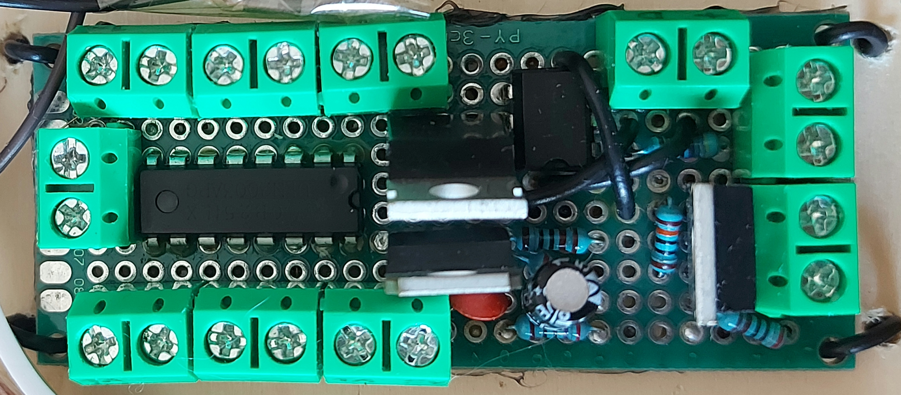
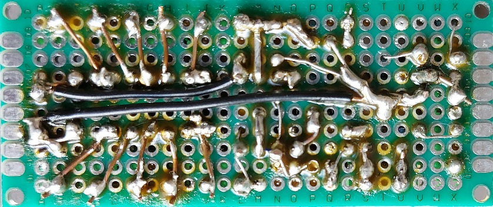
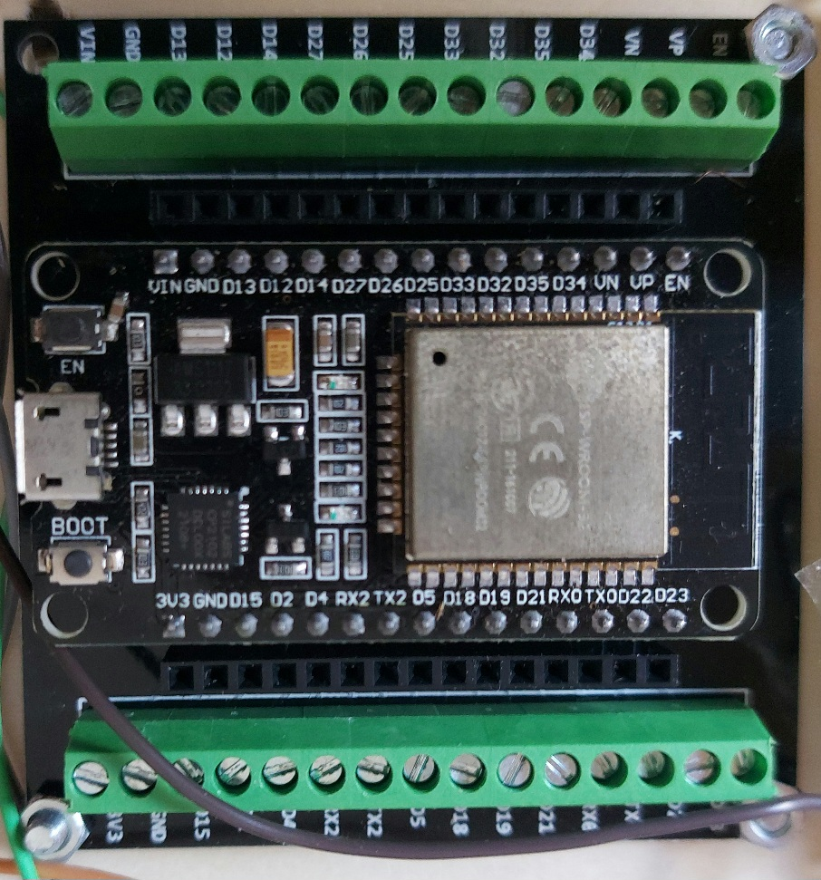

## Descripción 👋

<!--
**microindoor/microindoor** is a ✨ _special_ ✨ repository because its `README.md` (this file) appears on your GitHub profile.

Here are some ideas to get you started:

- 🔭 I’m currently working on ...
- 🌱 I’m currently learning ...
- 👯 I’m looking to collaborate on ...
- 🤔 I’m looking for help with ...
- 💬 Ask me about ...
- 📫 How to reach me: ...
- 😄 Pronouns: ...
- ⚡ Fun fact: ...
-->
Microindoor permite crear un cultivo indoor a medida según los recursos de los que uno disponga, puedes utilizar relés para luz, resistencias eléctricas, o ventiladores de CA, o PWM y mosfets si esos aparatos funcionan con CC, termistores y no ventiladores si sólo vas a medir temperatura y no puedes regularla porque no tienes ventiladores, o termistores y si ventiladores si los tienes, o si consigues un dht22 puedes medir además humedad, y si tienes ventiladores puedes regular los 2 valores según los configures, las combinaciones y posibilidades son enormes. Puedes configurar y personalizar hasta un máximo de 3 salas y todo se hace por bluetooth.
## Hardware, parte física
Está hecho sobre la marcha, es sencillo y no hice esquema

